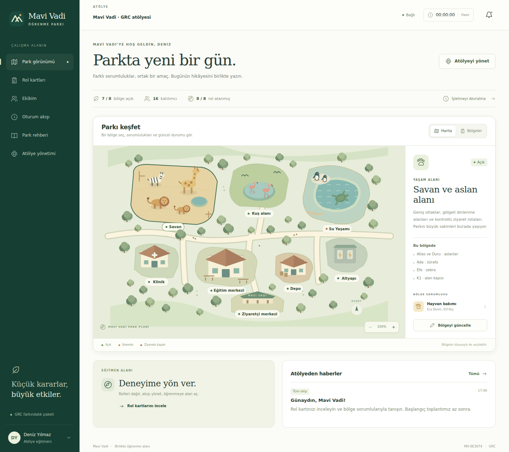

# Mavi Vadi · Öğrenme Parkı

Kurum içi GRC farkındalık atölyeleri için hayvanat bahçesi simülasyonu. Katılımcılar aynı atölyeye kendi kullanıcılarıyla girer, rollerini üstlenir ve parkın güncel durumunu birlikte takip eder.

Bu sürüm **oynanabilir uygulama altyapısıdır**. Olayların dallanması, risk/kontrol kayıtları, puanlama ve Niles bağlantısı henüz eklenmedi. Senaryo değerlendirmesi sürerken giriş, rol, harita ve oturum deneyimi bağımsız olarak geliştirilebilir.



[Giriş ekranı](docs/preview-login.png) · [Rol kartları](docs/preview-roles.png) · [Telefon görünümü](docs/preview-mobile.png)


[Giriş ekranı](docs/preview-login.png) · [Rol kartları](docs/preview-roles.png) · [Mobil görünüm](docs/preview-mobile.png)

Ekran görüntüleri kurgusal örnek atölye verileriyle alınmıştır. Yeni kurulum katılımcı ve duyuru içermeyen bir atölyeyle başlar.

## Hızlı başlangıç

**Gereksinim: Node.js 24 veya üzeri.** Üretim için harici npm bağımlılığı ve derleme adımı yoktur.

```bash
cp .env.example .env
npm start
```

Tarayıcıda `http://localhost:3000` adresini açın. İlk çalıştırmada `egitmen` hesabı oluşturulur. `.env` içinde `ADMIN_PASSWORD` belirlenmemişse rastgele başlangıç parolası terminalde **bir kez** gösterilir. İlk girişten sonra kullanıcı menüsünden parolanızı değiştirebilirsiniz.

`ADMIN_USERNAME`, `ADMIN_NAME` ve `ADMIN_PASSWORD` yalnız veritabanı ilk oluşturulurken kullanılır; mevcut hesabın parolasını değiştirmez. `.env` ve veritabanı Git'e eklenmez.

## İlk atölye

1. Eğitmen hesabıyla giriş yapın. İlk atölye otomatik hazırlanır.
2. **Atölye yönetimi → Katılımcı ekle** ile kullanıcı adı, başlangıç parolası ve rol belirleyin. Bilgileri ilgili katılımcıya iletin. Bir rolü birden fazla kişi paylaşabilir.
3. Katılımcılar aynı sunucu adresinden kendi hesaplarıyla giriş yapsın. Aynı yerel ağda sunucunun IP adresi ve 3000 portu kullanılabilir.
4. **Park görünümü** üzerinden bölgeleri keşfedin; **Rolüm** ekranından başlangıç bilgilerini okuyun.
5. Eğitmen **Oturum akışı** ekranında saati başlatabilir, duraklatabilir ve bölümler arasında geçebilir. Bölüm geçişi saati duraklatır.
6. Eğitmen bölge durumunu ve ortak notunu değiştirebilir; tüm ekibe veya belirli bir role duyuru paylaşabilir.
7. Sonraki sınıf için **Yeni atölye** oluşturun. Ekip, saat, duyurular, bölge durumları ve kişisel notlar ayrıdır.

Mevcut sürümde kullanıcı adı uygulama genelinde benzersizdir; yeni atölye için yeni katılımcı hesapları oluşturulur. Mevcut hesabı başka atölyeye ekleme, hesap silme ve eğitmen tarafından parola sıfırlama henüz yoktur.

## Bu sürümde çalışanlar

| Alan                      | Davranış                                                                                   |
| ------------------------- | ------------------------------------------------------------------------------------------ |
| Giriş ve kullanıcı menüsü | Sunucuda doğrulama, profil adı, parola değiştirme, çıkış                                   |
| Etkileşimli 2D harita     | Sekiz bölge, hayvan ve tesis çizimleri, bölge seçimi, yakınlaştırma, liste görünümü        |
| Bölge yönetimi            | Açık / izlemde / ziyarete kapalı, ortak durum notu, ilgili rol ve varlıklar                |
| Rol kartları              | Sekiz rol; katılımcının kendi özel kartı, diğer rollerin ortak sorumlulukları, yazdırma    |
| Ekip                      | Kullanıcı oluşturma, rol atama/değiştirme, isim ve rol araması                             |
| Kişisel not               | Kullanıcıya ve atölyeye özel, kalıcı not                                                   |
| Oturum akışı              | 240 dakika, sekiz bölüm, başlat/duraklat/bölüme geç, süre sonunda tamamlanma               |
| Eğitmen paneli            | Yeni atölye, rol dolulukları, duyurular, işlem geçmişi                                     |
| Ortak görünüm             | Sunucudan dört saniyede bir güncelleme, bağlantı kesilmesi bildirimi                       |
| Mobil ve klavye           | Dar ekran menüsü, kaydırılabilir harita, alternatif bölge listesi, klavye ile bölge seçimi |

Saat eğitmen tarafından yönetilir. Sürenin ilerlemesi bir olayı otomatik başlatmaz veya bir bölgeyi kendiliğinden kapatmaz. Atölye hareketleri yalnız uygulamadaki işlemlerdir; eğitim performans puanı değildir.

## Yapı ve senaryo güncelleme

| Konum                 | Amaç                                                                                                         |
| --------------------- | ------------------------------------------------------------------------------------------------------------ |
| `content/grc-v1.json` | Rol metinleri, bölge bilgileri, bölüm süreleri, rehber; gelecekteki olay içerikleri için boş `events` dizisi |
| `public/map.js`       | Özgün SVG park çizimi ve bölge geometrileri                                                                  |
| `public/views.js`     | Sayfalar ve bileşenler                                                                                       |
| `public/app.js`       | Giriş, gezinti, formlar, API ve ortak durum güncellemesi                                                     |
| `public/styles.css`   | Görsel tasarım, responsive düzen, yazdırma                                                                   |
| `server/app.js`       | HTTP API ve rol/atölye erişim kontrolleri                                                                    |
| `server/store.js`     | SQLite kalıcılığı ve kullanıcı oturumları                                                                    |
| `server/content.js`   | Senaryo doğrulama ve süre hesapları                                                                          |
| `test/app.test.js`    | Gerçek HTTP istekleri ve geçici veritabanıyla entegrasyon testleri                                           |

Metinler uygulama koduna gömülü değildir. Senaryo JSON'unu düzenleyip sunucuyu yeniden başlatın. Rol, bölge ve bölüm **ID'lerini koruyun**; bunlar kayıtlarla ve harita geometrisiyle ilişkilidir. Mevcut atölyeler güncellenen içeriği görür; bu sürüm atölye başına senaryo sürümünü dondurmaz. Yeni ID'ler, harita geometrileri ve paket ekleme ayrı bir geliştirme adımıdır.

GRC taslağı mevcut eğitim planından alınmıştır. ITIL paketi, olay dağıtımı, risk/kontrol/kanıt ilişkileri ve Niles adaptörü bu temel üzerinde geliştirilecektir. Şimdilik tek GRC paketi yüklenir.

## Veriler ve basit erişim modeli

- SQLite dosyası varsayılan olarak `data/mavi-vadi.sqlite` konumundadır. Yeniden başlatmalar veriyi silmez.
- Parolalar scrypt ile özetlenir. Oturumlar sekiz saatlik HttpOnly/SameSite çerezidir. Parola değişince kullanıcının tüm oturumları kapanır.
- Eğitmen bütün atölyeleri görür. Katılımcı yalnız üyesi olduğu atölyeyi görür. Kişisel notlar eğitmene de gönderilmez.
- Başka rollerin özel başlangıç bilgileri katılımcının API yanıtına dahil edilmez. Bu public repodaki senaryo metinleri elbette kaynak koddan okunabilir; rol ayrımı uygulama deneyiminin parçasıdır.
- Eğitimde kurgusal bilgiler kullanılır. Üretim amacıyla SSO, MFA, kullanıcı daveti, e-posta veya karmaşık yetki modeli eklenmemiştir.

Sunucu **tek uygulama süreci ve kalıcı yerel disk** için tasarlandı. Geçici disk kullanan serverless ortamlara veritabanını doğrudan koymayın. Dış erişim için HTTPS reverse proxy kullanıp `COOKIE_SECURE=true` ayarlayın. Ağ erişimi ve HTTPS kurulumu bu repoda otomatik yapılmaz.

Yedek almak için uygulamayı durdurun ve `data/` dizininin tamamını kopyalayın; çalışan SQLite veritabanının yalnız ana dosyasını kopyalamayın.

## Docker

```bash
docker build -t mavi-vadi .
docker run --name mavi-vadi --env-file .env -p 3000:3000 \
  -v mavi-vadi-data:/app/data mavi-vadi
```

Başlangıç parolası otomatik üretildiyse `docker logs mavi-vadi` içinde görünür. Veri volume içinde saklanır. `.env` dosyası imaja eklenmez. Özel port kullanırsanız hem `.env` hem port eşlemesini değiştirin.

## Geliştirme ve doğrulama

```bash
npm run dev
npm run check
npm test
```

`check` JavaScript sözdizimini ve senaryo yapısını kontrol eder. Entegrasyon testleri giriş/çıkış, yetki sınırları, özel rol bilgileri, atölye ve not ayrımı, role özel duyuru, yeniden başlatma sonrası kalıcılık, süre yönetimi, parola değişikliği ve hatalı girdileri kapsar. GitHub Actions aynı kontrolleri çalıştırır.

Tarayıcı testleri için geliştirme bağımlılıklarını kurun:

```bash
npm ci
npx playwright install chromium
npm run test:browser
```

Beş tarayıcı testi ayrı eğitmen/katılımcı oturumlarını, rol değişiminde açık kartın ve notun korunmasını, yavaş kaydetme sırasında yeni metin yazılmasını, eski ağ yanıtlarının yeni kaydı geri almamasını, bağlantı uyarılarını ve 1440/768/390/360 px düzenlerini kapsar. Geçici veritabanı ve rastgele test parolaları kullanılır. Playwright yalnız geliştirme bağımlılığıdır; uygulamayı çalıştırmak için `npm ci` gerekmez. GitHub Actions bu testleri de çalıştırır.

`SCREENSHOT_DIR=test-results npm run test:browser` ile masaüstü ve telefon ekran görüntüleri alınabilir. Hazır bir Chromium kurulumu kullanılacaksa `PLAYWRIGHT_CHROMIUM_EXECUTABLE_PATH` ile yolu belirtilebilir.

`docs/architecture.md` API ve genişletme noktalarını özetler.
